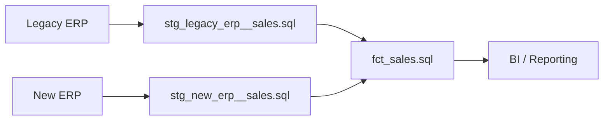

## Introduction

**The ERP go-live is successful**. Orders are processing, inventory is updating and invoices are posting. Everything looks good.

But then the issues start. The report still runs but the KPI is off by 4%. Historical comparisons are no longer lining up.

The ERP go-live was successful. **The analytics migration failed**. The failures in the analytics migration aren't always obvious. For example:

- Revenue is calculated differently in the new ERP
- Customer/product IDs have changed
- Returns or discounts are represented differently

The failure was because the **definitions in the legacy ERP don't match the new ERP**.  The same business concepts are represented differently. 

Decoupling analytics from the ERP before the migration is completed can alleviate reporting issues at go-live by creating a stable analytics layer that's independent of the ERP. In practice, this means creating a unified data warehouse where data is transformed according to consistent business definitions.

**Key Questions**

- How to handle historical ERP data?
- How do we make historical and new ERP data mean the same thing?

## How to handle historical ERP data?

>A successful ERP go-live doesn't guarantee trusted reporting after go-live.

### Archive the legacy data you need

No matter how you handle the analytics migration, it is recommended that you keep a copy of the raw data as an insurance policy against system failures. A simple solution like storing the raw data files in an S3 bucket is generally sufficient.

But preserving the data doesn't mean it's usable for analytics. It still needs to be transformed into an analytics-ready model.

### Three options for historical reporting

*How will users access and analyze that historical data going forward?*

| Option                                   | Tradeoff                                                     | Best fit                                                     |
| ---------------------------------------- | ------------------------------------------------------------ | ------------------------------------------------------------ |
| **Keep legacy ERP available**            | **+** Minimal historical data migration; existing reporting can continue. <br />**−** Ongoing cost; vendor dependency; difficult to do comparison reporting between old and new. | Short-term bridge                                            |
| **Migrate history to new ERP**           | **+** Historical and current transactions in one operational system. <br />**−** Expensive and complex; requires migration work primarily for analytics. | History is needed operationally. Don't migrate history solely because analytics needs it. |
| **Build analytics layer outside of ERP** | **+** Reporting continuity; unified old/new reporting; independent business definitions. <br />**−** Requires engineering and mapping work. | Long-term analytics                                          |


## Build analytics layer outside of ERP


Your ERP should not be the foundation of your analytics system. ERPs will change. The analytical models should represent stable business concepts, not the structure of the particular ERP you are currently running.

In addition, keeping the analytics separate allows for much more flexibility. If you're relying on the ERP for analytics it may be difficult to integrate external sources like web analytics.

### How does this work?

We create a unified business model by transforming legacy and new ERP data into a consistent set of analytics tables within the data warehouse. This is necessary because the legacy and new ERPs won't have identical schemas and business definitions. Instead of applying transformation logic in every dashboard and report, we map both into stable fields that represent the business. Here's a simplified example.

```
LEGACY ERP                              NEW ERP
cust_id                              customer_number
invoice_dt                           transaction_date
sales_amt                            net_amount
    │                                    │
    │                                    │
    └───────────────┐    ┌───────────────┘
                    ↓    ↓
                    SALES
                 customer_id
               transaction_date
                   revenue
```

But it's not as simple as renaming fields because there may not be one-to-one mapping across the systems. For instance, transformation logic may need to be applied to get from `sales_amt` to the agreed-upon business definition of `revenue`.

Then during the transition, both ERPs feed the data warehouse. Once migration is completed, historical transactions remain in the warehouse and new transactions will arrive from the new ERP.

A five-year sales chart can contain three years from the legacy ERP and two years from the new ERP without the dashboard needing to understand either system's underlying schema.

### Here's a simplified technical system architecture




### And corresponding example code

`stg_legacy_erp__sales.sql` 

```sql
select
    cust_id as customer_id,
    invoice_dt as transaction_date,
    sales_amt as revenue
from {{ source('legacy_erp', 'sales') }}
```

`stg_new_erp__sales.sql` 

```sql
select
    customer_number as customer_id,
    transaction_date,
    net_amount as revenue
from {{ source('new_erp', 'sales') }}
```

`fct_sales.sql` 

```sql
select *
from {{ ref('stg_legacy_erp__sales') }}
where transaction_date < '2026-01-01'

union all

select *
from {{ ref('stg_new_erp__sales') }}
where transaction_date >= '2026-01-01'
```


## Start the analytics migration before ERP go-live

**You don't need to wait for ERP go-live.** Archive history, inventory reports, document business logic, build models, and establish reconciliation tests beforehand. This reduces the number of things that need to change simultaneously at go-live.

Much of the analytics foundation can already be in place by go-live. At go-live, we connect the new ERP to the data warehouse, validate, and refine data mapping if discrepancies are found.


## Mapping business logic in legacy and new ERPs

>The schemas don't just use different column names. The actual business concepts may differ. Giving two fields the same name does not make them equivalent.

To properly map old and new ERPs, we need input from engineers and business SMEs. Here are four types of mapping that must take place.

### 1. Field names

 This is the simplest. We must map new and old fields to follow the same nomenclature.

```
invoice_dt -> transaction_date
```

### 2. KPIs and business concepts

Renaming fields isn't enough when the underlying definitions don't match. Here are a few example questions that may need to be answered.

- Is `net_amount` equivalent to `sales_amt`?
- Does `net_amount` include returns?
- Does `sales_amt` include discounts?
- What's the current business definition of revenue?

The goal is to transform both `net_amount` and `sales_amt` into the agreed-upon business definition of revenue.

### 3. Entity identity

Are they the same customer?

```
Old ERP                    New ERP
Customer 1042              Customer C-88291
"Acme Inc."                "Acme Corporation"
```

Create a cross-walk between old and new customer names and IDs.

| Old ERP                  | New ERP                         | Unified Customer ID |
| ------------------------ | ------------------------------- | ------------------- |
| 1042 / Acme Inc.         | C-88291 / Acme Corporation      | 1001                |
| 2051 / Global Industries | C-10442 / Global Industries LLC | 1002                |
| 3177 / Smith Supply      | C-20118 / Smith Supply Co.      | 1003                |

### 4. Units and hierarchies

The legacy and new ERPs may track and categorize elements differently.

**The units of measurement are different.** For example, the legacy ERP tracked cases and the new ERP tracks items. You would need conversion logic so historical quantities are comparable with future data.

**Product categorization hierarchy is different.** 

```
Equipment → Pumps in the legacy ERP 
Industrial → Fluid Handling → Pumps in the new ERP. 
```

Sometimes this means transforming the new data to match the old definitions. Other times this means adopting new business definitions.

The goal isn't to make the old and new data look the same. They need to mean the same thing.

## Reconciliation and validation

Reconciliation needs to happen before the legacy ERP is retired. Ideally, there is a period where reporting from the legacy system can be compared against the new analytics environment.

A discrepancy isn't necessarily an error. The important piece is to understand and be able to explain the difference.

There are three levels of validation and reconciliation:

- **Basic data checks.** Row counts, date ranges, missing records, duplicate records
- **Business reconciliation.** Revenue, orders, inventory, customer counts, other critical KPIs
- **Reporting reconciliation.** Compare old and new dashboards, explain discrepancies

Start reconciliation with basic data checks. Drill into the underlying data as discrepancies are identified. It's not uncommon to find differences because a migration may force some changes to business definitions. The goal is to identify and understand every material discrepancy, not to get a perfect match between legacy and new.

## Migration is an opportunity for housekeeping

When you find technical debt during the transition, don't migrate it. Things such as:

- duplicate or obsolete reports
- calculations buried in BI tools
- spreadsheets functioning as databases
- conflicting KPI definitions
- key-person dependencies

Solve the issues rather than pushing them to the new system.

## Key Takeaways

- **ERP migration and analytics migration are separate but coordinated projects.**
- **Archive historical data before decommissioning the legacy ERP.**
- **Build reporting around stable business concepts rather than ERP schemas.**
- **Reconcile old and new before trusting the new reporting.**

**Questions to Answer**

1. Where will historical data live?
2. Which reports are business-critical?
3. Where does the business logic behind those reports currently live?
4. How will old and new ERP entities be mapped?
5. How will historical and new transactions be reported together?
6. How will you reconcile the new reporting against the old?
7. When can the legacy ERP actually be turned off?

